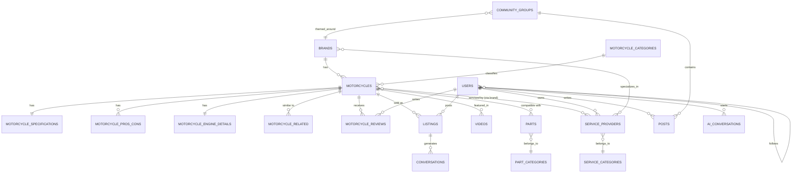

# 2. Ma'lumotlar Bazasi Arxitekturasi

Barcha jadvallarda standart ustunlar bor deb hisoblanadi: `id` (bigint, PK), `created_at`, `updated_at` (va kerak bo'lsa `deleted_at` — soft delete). Ular pastda takror ko'rsatilmaydi.

Katta hajmni ko'tarish uchun: `motorcycles`, `listings`, `parts`, `posts` kabi tez o'sadigan jadvallarda **indexlash** (`slug`, `status`, `brand_id`, `city_id`, composite index'lar filtr uchun) va `motorcycle_specifications`dagi raqamli ustunlarda **range index** majburiy.

---

## 2.1 Foydalanuvchilar va Ruxsatlar (Core)

### `users`
| Ustun | Tur | Izoh |
|---|---|---|
| name | string | |
| username | string, unique | Profil URL uchun (`/profile/{username}`) |
| email | string, unique, nullable | |
| phone | string, unique | O'zbekistonda telefon asosiy login bo'lishi mumkin |
| password | string | |
| avatar | string, nullable | media-library orqali ham bo'lishi mumkin |
| bio | text, nullable | |
| city_id | FK → cities, nullable | |
| experience_level | enum(beginner, intermediate, expert), nullable | AI tavsiyasi uchun |
| height_cm | smallint, nullable | AI tavsiyasi uchun |
| budget_usd | integer, nullable | AI tavsiyasi uchun |
| phone_verified_at | timestamp, nullable | |
| email_verified_at | timestamp, nullable | |
| status | enum(active, banned, pending) | |
| last_active_at | timestamp, nullable | |

### `roles`, `permissions`, `model_has_roles`, `model_has_permissions`, `role_has_permissions`
> spatie/laravel-permission standart jadvallari. Rollar: `admin`, `moderator`, `content_manager`, `seller`, `service_provider`, `user`.

### `countries`
`id, name, code`

### `cities`
`id, country_id FK, name, lat, lng`

### `user_follows`
`follower_id FK→users, following_id FK→users` — foydalanuvchilar bir-birini kuzatishi (community uchun)

### `saved_items` (universal wishlist)
`user_id FK, saveable_id, saveable_type` — polymorphic: motorcycle, listing, part, post saqlash uchun bitta jadval

---

## 2.2 Brend / Model Katalogi (Yadro — "Bilim daraxti")

### `brands`
| Ustun | Tur |
|---|---|
| name | string |
| slug | string, unique, indexed |
| logo | (media-library) |
| country_id | FK → countries, nullable |
| founded_year | year, nullable |
| description | text, nullable |
| is_active | boolean |

### `motorcycle_categories`
`id, name, slug` — Sport, Cruiser, Naked, Adventure, Scooter, Chopper, Enduro, Klassik

### `motorcycles`
| Ustun | Tur | Izoh |
|---|---|---|
| brand_id | FK → brands | |
| category_id | FK → motorcycle_categories | |
| name | string | masalan "R1" |
| slug | string, unique, indexed | `/motorcycles/yamaha/r1` |
| generation | string, nullable | masalan "2020-2024" |
| year_start / year_end | year | |
| history | longtext, nullable | Tarixi |
| description | text | |
| status | enum(draft, published) | |
| views_count | unsignedInteger, default 0 | |
| meta_title / meta_description | string/text, nullable | SEO |

**Relationship**: `Brand hasMany Motorcycle`

### `motorcycle_specifications` (1:1 bilan `motorcycles`)
| Ustun | Tur |
|---|---|
| motorcycle_id | FK → motorcycles, unique |
| engine_type | string (masalan "Inline-4") |
| displacement_cc | unsignedSmallInteger, **indexed** |
| horsepower | unsignedSmallInteger, **indexed** |
| torque_nm | unsignedSmallInteger |
| top_speed_kmh | unsignedSmallInteger |
| weight_kg | unsignedSmallInteger |
| fuel_capacity_l | decimal(5,1) |
| fuel_consumption_l_100km | decimal(4,1) |
| transmission | string |
| cooling_system | string |
| price_usd_min / price_usd_max | unsignedInteger, **indexed** |
| reliability_score | decimal(2,1), nullable | 1-5 ball, sharhlar asosida hisoblanadi |
| beginner_friendly | boolean, **indexed** | Taqqoslash va AI filtri uchun |

> **Nega alohida jadval?** `motorcycles` — kontent (nom, tarix), `motorcycle_specifications` — raqamli, filtrlanadigan/taqqoslanadigan ma'lumot. Ajratish query performance va kod tozaligini beradi.

### `motorcycle_media` *(agar media-library ishlatilmasa, alternativ)*
`motorcycle_id, type enum(image, engine_image, video), path, order` — **Tavsiya**: buning o'rniga `spatie/laravel-medialibrary` collection'laridan foydalanish (`gallery`, `engine`, `cover`).

### `motorcycle_pros_cons`
`motorcycle_id FK, type enum(pro, con), text`

### `motorcycle_engine_details`
`motorcycle_id FK unique, animation_url nullable, working_principle text` — "Dvigatel ishlash prinsipi" bo'limi

### `motorcycle_related` (self-referencing pivot)
`motorcycle_id FK, related_motorcycle_id FK` — "O'xshash modellar". Avtomatik (kategoriya+narx oralig'i bo'yicha algoritm) yoki admin tomonidan qo'lda belgilanishi mumkin (`is_manual` boolean).

---

## 2.3 Taqqoslash

### `comparisons`
`id, user_id FK nullable, session_token string nullable` — login qilmagan foydalanuvchi ham vaqtinchalik taqqoslay olishi uchun

### `comparison_items`
`comparison_id FK, motorcycle_id FK`

> Taqqoslash jadvali asosan UI/session darajasida ishlaydi (`?compare=1,5,9`); DB'da saqlash faqat **ulashiladigan link** (`/compare/{token}`) yaratish uchun kerak.

---

## 2.4 Moto Bozori (Market)

### `listings`
| Ustun | Tur |
|---|---|
| user_id | FK → users |
| motorcycle_id | FK → motorcycles, **nullable** | Katalogdagi aniq modelga bog'lash (tavsiya qilinadi, lekin majburiy emas) |
| brand_id | FK → brands, nullable | motorcycle_id bo'lmasa ham brend bo'yicha filtr uchun |
| custom_title | string, nullable | katalogda yo'q model uchun erkin nom |
| year | year | |
| price | decimal(12,2) | |
| currency | enum(USD, UZS) | |
| mileage_km | unsignedInteger | |
| condition | enum(new, used) | |
| city_id | FK → cities | |
| description | text | |
| status | enum(pending, active, sold, rejected, expired), **indexed** | |
| is_featured | boolean | Pullik/tavsiya etilgan e'lonlar |
| views_count | unsignedInteger | |
| published_at | timestamp, nullable | |

**Composite index**: `(status, brand_id, city_id, price)` — filtrlash tezligi uchun.

### `listing_reports`
`listing_id FK, user_id FK, reason string, status enum(pending, reviewed)`

### `conversations`
`id, listing_id FK nullable, buyer_id FK→users, seller_id FK→users`

### `messages`
`conversation_id FK, sender_id FK→users, body text, attachment nullable, read_at nullable`

---

## 2.5 Ehtiyot Qismlar (Parts)

### `part_categories`
`id, parent_id FK self nullable, name, slug` — Dvigatel qismlari, Tormoz qismlari, Moy va filtrlar, Elektr qismlar, Aksessuarlar (nested tree, `parent_id` orqali)

### `parts`
| Ustun | Tur |
|---|---|
| seller_id | FK → users |
| category_id | FK → part_categories |
| name | string |
| slug | string, unique |
| part_type | enum(oem, aftermarket) |
| part_number | string, nullable |
| price | decimal(12,2) |
| stock_qty | unsignedInteger |
| condition | enum(new, used) |
| description | text |
| status | enum(pending, active, sold_out, rejected) |

### `part_motorcycle` (pivot — **eng muhim bog'lovchi jadval**)
`part_id FK, motorcycle_id FK` — "Yamaha R1 uchun mos ehtiyot qismlar" shu orqali topiladi

---

## 2.6 Servislar

### `service_categories`
`id, name, slug` — Usta, Servis markazi, Ehtiyot qism sotuvchisi, Tyuning markazi

### `service_providers`
| Ustun | Tur |
|---|---|
| user_id | FK → users, nullable |
| category_id | FK → service_categories |
| name | string |
| city_id | FK → cities |
| address | string |
| lat / lng | decimal | Xarita uchun |
| phone | string |
| working_hours | json | |
| description | text |
| verified | boolean | |
| rating_avg | decimal(2,1), default 0 | |

### `service_provider_brand` (pivot)
`service_provider_id FK, brand_id FK` — qaysi brendlar bo'yicha ixtisoslashgan

### `service_reviews`
`service_provider_id FK, user_id FK, rating tinyint, comment text`

---

## 2.7 Video Platforma

### `video_categories`
`id, name, slug` — Sharh, AI video, Dvigatel tushuntirish, Ichki tuzilish, Tarixiy, Taqqoslash

### `videos`
| Ustun | Tur |
|---|---|
| category_id | FK → video_categories |
| motorcycle_id | FK → motorcycles, nullable |
| title | string |
| slug | string, unique |
| url_or_path | string | (Youtube link yoki lokal fayl) |
| duration_seconds | unsignedInteger |
| is_ai_generated | boolean |
| views_count | unsignedInteger |
| published_at | timestamp |

### `video_comments`, `video_likes`
Standart polimorfik `likes` jadvaliga birlashtirish mumkin (pastga qarang).

---

## 2.8 Hamjamiyat (Community)

### `community_groups`
`id, name, slug, brand_id FK nullable, cover_image, description, privacy enum(public, private)`

### `group_members`
`group_id FK, user_id FK, role enum(member, moderator)`

### `posts`
| Ustun | Tur |
|---|---|
| user_id | FK → users |
| group_id | FK → community_groups, nullable |
| motorcycle_id | FK → motorcycles, nullable | Post biror model bilan bog'liq bo'lsa |
| type | enum(post, question) | |
| body | text |
| status | enum(published, hidden, reported) |

### `post_images` *(yoki media-library)*
`post_id FK, path, order`

### `comments` (universal, polymorphic)
`commentable_id, commentable_type, user_id FK, parent_id nullable, body` — `posts`, `videos` uchun bitta jadval

### `likes` (universal, polymorphic)
`likeable_id, likeable_type, user_id FK` — `posts`, `comments`, `videos` uchun bitta jadval

---

## 2.9 Foydalanuvchi Sharhlari (Motorcycle Reviews)

### `motorcycle_reviews`
| Ustun | Tur |
|---|---|
| motorcycle_id | FK → motorcycles |
| user_id | FK → users |
| rating | tinyint (1-5) |
| ownership_period | string, nullable | "2 yildan beri" |
| pros | text, nullable |
| cons | text, nullable |
| body | text |
| status | enum(pending, approved, rejected) |

> `motorcycle_specifications.reliability_score` shu jadvaldagi o'rtacha ball asosida cron/observer orqali avtomatik yangilanadi.

---

## 2.10 AI Yordamchi

### `ai_conversations`
`id, user_id FK nullable, session_token, started_at`

### `ai_messages`
`conversation_id FK, role enum(user, assistant), content text, meta json nullable, created_at`

> `meta` — AI javobida tavsiya etilgan `motorcycle_id`lar yoki qidiruv parametrlari saqlanadi (analitika va "AI eng ko'p qaysi modellarni tavsiya qiladi" statistikasi uchun).

---

## 2.11 Yangiliklar

### `news_categories`
`id, name, slug`

### `news`
`category_id FK, author_id FK→users, title, slug, cover_image, body longtext, status, published_at`

---

## 2.12 Tizim jadvallari

- `media` — spatie/laravel-medialibrary standart jadvali (barcha rasm/video shu yerda, `model_type`+`model_id` orqali istalgan jadvalga bog'lanadi)
- `activity_log` — spatie/laravel-activitylog (admin audit)
- `settings` — key-value (`key`, `value json`) — sayt sozlamalari, homepage curation
- `notifications` — Laravel standart (bildirishnomalar: yangi xabar, e'lon tasdiqlandi va h.k.)

---

## 2.13 Munosabatlar sxemasi (ERD, matnli)

## 2.14 Kengaytirish uchun tayyorgarlik

- Barcha kontent jadvallari (`brands.name`, `motorcycles.name/description`, `news.title/body`) **kelajakda** `spatie/laravel-translatable` bilan JSON-based translatable ustunlarga o'tkazilishi mumkin — hozircha oddiy `string`/`text`, lekin migratsiya nomlari va model struktura shu o'tishga tayyor qilib yoziladi (har bir translatable bo'lishi mumkin bo'lgan ustun alohida `$translatable` massivda hujjatlashtiriladi).
- `motorcycle_specifications`da qo'shimcha texnik parametrlar kerak bo'lsa, jadvalga ustun qo'shish o'rniga **EAV emas**, balki oddiy `ALTER TABLE` bilan davom etiladi (chunki ustunlar soni cheklangan va indexlanishi kerak — EAV filtrlashni sekinlashtiradi).
